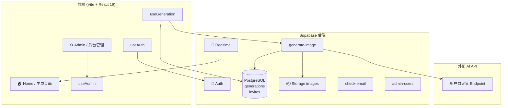

# VISION (影境) — AI 图片生成平台

实验性 AI 图片生成平台。支持多模型自定义配置、实时生成状态追踪、历史记录管理，以及完整的后台管理系统。

---

## Features

- 交互式 ASCII 月亮场 Hero 背景
- 多模型自定义配置（后台管理 API Endpoint / Key / Model ID）
- AI 图片实时生成与状态追踪（pending → generating → completed / failed）
- Supabase 实时订阅自动刷新历史记录
- 用户认证与邮箱确认
- 后台管理面板（模型配置、生成记录、用户管理）
- 图片生命周期管理（active → expiring → expired）

---

## Tech Stack

- React 19 + TypeScript + Vite
- React Router (HashRouter)
- Tailwind CSS v3
- Supabase (Auth + PostgreSQL + Storage + Edge Functions)

---

## 系统架构



---

## 快速部署

### 1. 环境变量

```bash
cd app
cp .env.example .env
```

填写 `.env`：

```env
VITE_SUPABASE_URL=https://your-project.supabase.co
VITE_SUPABASE_ANON_KEY=your-anon-key
```

> 只需这两项。外部 API 的 Key 和 Endpoint **通过后台管理配置**，无需写入环境变量。

### 2. 安装依赖

```bash
npm install
```

### 3. 数据库 Schema

在 Supabase Dashboard → **SQL Editor** 中执行 `supabase/schema.sql` 全部内容。

### 4. 创建 Storage Bucket

Dashboard → Storage → **New bucket**：
- Name: `images`
- 勾选 **Public bucket**

### 5. 部署 Edge Functions

```bash
# 登录并链接项目
supabase login
supabase link --project-ref your-project-ref

# 部署三个函数
supabase functions deploy generate-image --no-verify-jwt
supabase functions deploy check-email --no-verify-jwt
supabase functions deploy admin-users --no-verify-jwt
```

> `--no-verify-jwt` 必需。JWT 验证放在 Edge Function 代码内处理。

### 6. 邮件模板（可选）

Dashboard → Authentication → **Email Templates**，替换为 `supabase/email-templates.md` 中的内容。

同时设置 **Site URL** 为 `http://localhost:5173`（开发）或你的生产域名。

### 7. 启动

```bash
npm run dev
```

访问 `http://localhost:5173`

---

## 首次使用

### 1. 注册账户

点击右上角登录 → 切换到注册 → 填写邮箱密码。

> 如果 Supabase 开启了邮箱确认，注册后去邮箱点击确认链接。

### 2. 进入后台配置模型

访问 `/#/admin/login`，密码：`admin123`

进入 **模型配置**，填写：

| 字段 | 说明 | 示例 |
|---|---|---|
| 显示名称 | 前端下拉框显示 | `GPT-Image-2` |
| 请求模型 ID | 传给 API 的 model 参数 | `gpt-image-2` |
| API Endpoint | 外部 API 地址 | `https://api.example.com/v1/images/generations` |
| API Key | 外部 API Key | `sk-xxx` |
| 请求协议 | API 格式 | `openai` |

保存后返回首页，选择模型，输入 prompt，点击 **执行**。

### 3. 图片生成流程

```
用户点击执行
  → 前端创建 pending 记录
  → 调用 Edge Function（传入 apiKey + apiEndpoint + model）
  → Edge Function 调用外部 AI API
  → 下载图片 → 上传 Storage
  → 更新数据库为 completed
  → Realtime 推送 → 前端展示图片
```

---

## 后台管理路径

| 路径 | 功能 |
|---|---|
| `/#/admin/login` | 管理员登录（密码：`admin123`） |
| `/#/admin` | 仪表盘 |
| `/#/admin/users` | 用户管理（真实 Supabase auth 用户） |
| `/#/admin/models` | 模型配置（Key / Endpoint / 协议） |
| `/#/admin/generations` | 生成记录（含 picture_id 和用户邮箱） |

---

## 关键文件

| 文件 | 说明 |
|---|---|
| `supabase/schema.sql` | 数据库初始 schema |
| `supabase/migrate_lifecycle.sql` | 生命周期字段迁移 |
| `supabase/email-templates.md` | 邮件模板 HTML |
| `supabase/functions/generate-image/index.ts` | 图片生成 Edge Function |
| `supabase/functions/check-email/index.ts` | 邮箱查重 Edge Function |
| `supabase/functions/admin-users/index.ts` | 用户列表 Edge Function |

---

## Troubleshooting

### 生成超时

外部 API 可能需要 2-3 分钟。前端已设置 `fetch` 300 秒超时。如果仍超时，检查网络或 API 服务状态。

### 数据库字段报错

执行一次迁移 SQL（见步骤 3）。

### 后台看不到真实用户

确认 `admin-users` Edge Function 已部署。管理员登录后会自动拉取 `auth.users`。

---

## License

MIT
