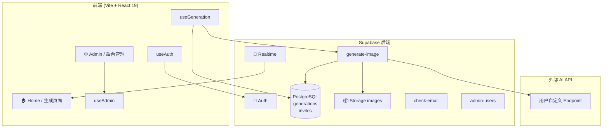

# VISION (影境) — AI 图片生成平台

实验性 AI 图片生成平台。支持多模型自定义配置、实时生成状态追踪、历史记录管理，以及完整的后台管理系统。

---

## Features

- 交互式 ASCII 月亮场 Hero 背景
- 多模型自定义配置（后台管理 API Endpoint / Key / Model ID）
- AI 图片实时生成与状态追踪（pending → generating → completed / failed）
- Supabase 实时订阅自动刷新历史记录
- 用户认证与邮箱确认
- 后台管理面板（模型配置、生成记录、用户管理）
- 图片生命周期管理（active → expiring → expired）

---

## Tech Stack

- React 19 + TypeScript + Vite
- React Router (HashRouter)
- Tailwind CSS v3
- Supabase (Auth + PostgreSQL + Storage + Edge Functions)

---

## 系统架构



---

## 快速部署

### 1. 环境变量

```bash
cd app
cp .env.example .env
```

填写 `.env`：

```env
VITE_SUPABASE_URL=https://your-project.supabase.co
VITE_SUPABASE_ANON_KEY=your-anon-key
```

本地首次启动并使用注册 / 登录时，前端 `.env` 只需要这两项：

| 变量 | 用途 | 去哪里获取 |
|---|---|---|
| `VITE_SUPABASE_URL` | 前端连接 Supabase 项目；未配置时登录、注册、历史记录都会走本地 fallback | Supabase Dashboard → **Connect** 里的 **Project URL**，或 Project Settings → **API** → **Project URL** |
| `VITE_SUPABASE_ANON_KEY` | 浏览器端公开 key，用于调用 Auth / Database / Functions | Supabase Dashboard → **Connect** 里的 API key，或 Project Settings → **API** → **anon / publishable key** |

说明：

- 这两个值写入 `app/.env`，不要写到 shell `export` 里。
- 外部 AI API 的 Key 和 Endpoint **通过后台管理配置**，不需要写入前端环境变量。
- 如果你希望本地注册后能收到确认邮件，Supabase Dashboard → Authentication → **URL Configuration** 里的 **Site URL** 需要设为 `http://localhost:5173`。
- 如果开启了邮箱确认，建议把 `http://localhost:5173` 也加入 **Redirect URLs**，避免确认邮件跳错环境。

### 2. 安装依赖

```bash
cd app
npm install
```

### 3. 首次初始化 Supabase

确保本机已安装 Supabase CLI，然后在 `app` 目录执行：

```bash
export SUPABASE_ACCESS_TOKEN=your-access-token
export PROJECT_REF=your-project-ref
export SUPABASE_DB_PASSWORD=your-db-password
npm run deploy:supabase:init
```

这条命令会自动完成：

- `supabase link --project-ref $PROJECT_REF`
- 执行 `app/supabase/migrations/*.sql`
- 创建公开的 `images` bucket
- 部署全部 Edge Functions

所需环境变量：

| 变量 | 说明 | 去哪里获取 |
|---|---|---|
| `SUPABASE_ACCESS_TOKEN` | Supabase 访问令牌，供 CLI 无交互认证 | Supabase Dashboard → Account → **Access Tokens**，新建一个 personal access token |
| `PROJECT_REF` | 项目 ref，例如 `abcd1234efgh5678` | Supabase Dashboard → Project Settings → **General** → **Reference ID**，也通常是项目域名 `https://<project-ref>.supabase.co` 里的那段前缀 |
| `SUPABASE_DB_PASSWORD` | `supabase link` / `db push` 连接远程数据库所需密码 | 创建项目时设置的数据库密码；如果忘了，可在 Supabase Dashboard 的数据库设置页面重置 |

> Edge Functions 的 `verify_jwt = false` 已写入 `app/supabase/config.toml`，不需要再手动加 `--no-verify-jwt`。

### 4. 邮件模板（可选）

Dashboard → Authentication → **Email Templates**，替换为 `app/supabase/email-templates.md` 中的内容。

同时设置：

- **Site URL**：开发环境填 `http://localhost:5173`，生产环境填你的正式域名
- **Redirect URLs**：至少加入 `http://localhost:5173`

### 5. 启动

```bash
cd app
npm run dev
```

访问 `http://localhost:5173`

---

## 首次使用

### 1. 注册账户

点击右上角登录 → 切换到注册 → 填写邮箱密码。

> 如果 Supabase 开启了邮箱确认，注册后去邮箱点击确认链接。

### 2. 进入后台配置模型

访问 `/#/admin/login`，密码：`admin123`

进入 **模型配置**，填写：

| 字段 | 说明 | 示例 |
|---|---|---|
| 显示名称 | 前端下拉框显示 | `GPT-Image-2` |
| 请求模型 ID | 传给 API 的 model 参数 | `gpt-image-2` |
| API Endpoint | 外部 API 地址 | `https://api.example.com/v1/images/generations` |
| API Key | 外部 API Key | `sk-xxx` |
| 请求协议 | API 格式 | `openai` |

保存后返回首页，选择模型，输入 prompt，点击 **执行**。

### 3. 图片生成流程

```
用户点击执行
  → 前端创建 pending 记录
  → 调用 Edge Function（传入 apiKey + apiEndpoint + model）
  → Edge Function 调用外部 AI API
  → 下载图片 → 上传 Storage
  → 更新数据库为 completed
  → Realtime 推送 → 前端展示图片
```

---

## 后台管理路径

| 路径 | 功能 |
|---|---|
| `/#/admin/login` | 管理员登录（密码：`admin123`） |
| `/#/admin` | 仪表盘 |
| `/#/admin/users` | 用户管理（真实 Supabase auth 用户） |
| `/#/admin/models` | 模型配置（Key / Endpoint / 协议） |
| `/#/admin/generations` | 生成记录（含 picture_id 和用户邮箱） |

---

## 关键文件

| 文件 | 说明 |
|---|---|
| `app/supabase/config.toml` | Supabase CLI 配置，含 bucket 和 function 配置 |
| `app/supabase/migrations/20260422143000_init_schema.sql` | 首次部署数据库迁移 |
| `app/supabase/schema.sql` | schema 快照 / 手工参考 |
| `app/supabase/email-templates.md` | 邮件模板 HTML |
| `app/supabase/functions/generate-image/index.ts` | 图片生成 Edge Function |
| `app/supabase/functions/check-email/index.ts` | 邮箱查重 Edge Function |
| `app/supabase/functions/admin-users/index.ts` | 用户列表 Edge Function |
| `app/scripts/deploy-supabase-init.mjs` | 无交互首次部署脚本 |

---

## Troubleshooting

### 生成超时

外部 API 可能需要 2-3 分钟。前端已设置 `fetch` 300 秒超时。如果仍超时，检查网络或 API 服务状态。

### 数据库字段报错

确认已在 `app` 目录执行 `npm run deploy:supabase:init`，并检查 `SUPABASE_DB_PASSWORD` 是否正确。

### 后台看不到真实用户

确认已执行 `npm run deploy:supabase:init`。管理员登录后会自动拉取 `auth.users`。

---

## License

MIT
